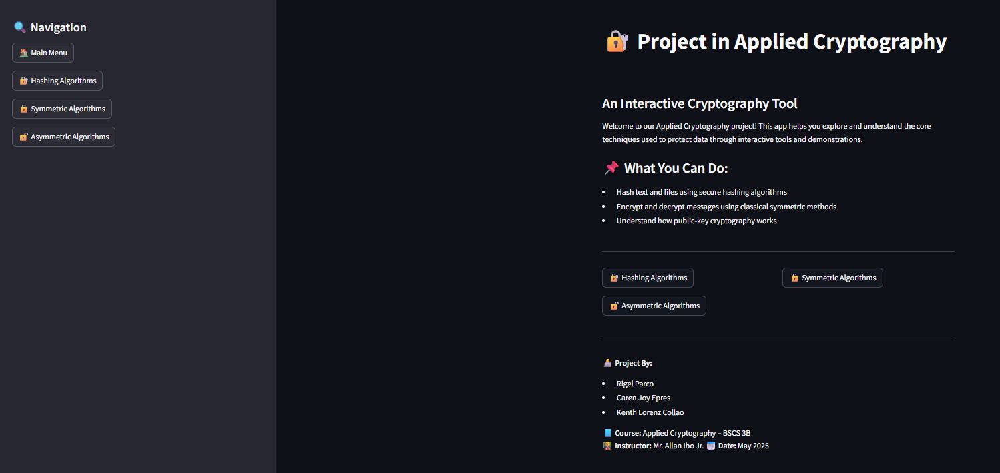
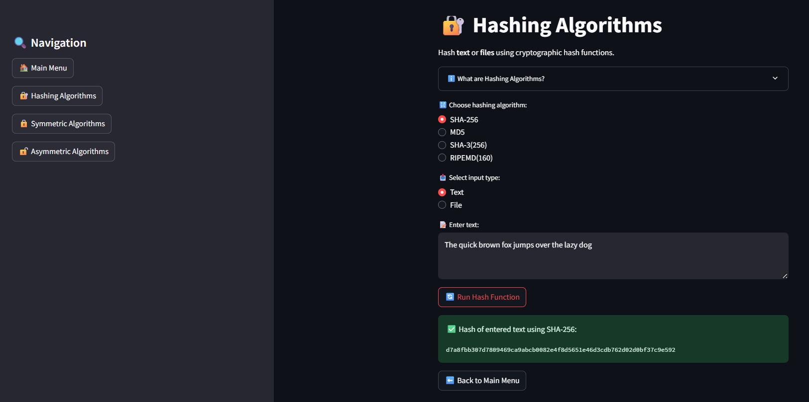
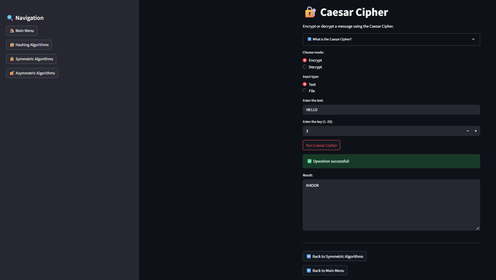

# 🔐 Cryptographic Application Toolkit  
**Course:** CSAC 329 – Applied Cryptography  
**Date:** May 21, 2025  

### Try the app 👇
[](https://sample-app-3b-parco.streamlit.app)

---

## 👥 Group Members
- Rigel Parco 
- Caren Joy Epres
- Kenth Lorenz Collao

---
## 📝 Introduction

This project, **Project in Applied Cryptography: An Interactive Cryptography Toolkit**, is a web-based educational tool designed to help users explore, understand, and experiment with a wide range of cryptographic algorithms. Built using Streamlit, the application provides an intuitive interface for hashing, encrypting, and decrypting both text and files using classical and modern cryptographic methods.

The purpose of this toolkit is to make cryptography accessible and interactive for students, educators, and enthusiasts. Cryptography is a cornerstone of information security, protecting data integrity, confidentiality, and authenticity in digital communications. By allowing users to see how different algorithms work in practice, this project highlights the importance of cryptography in securing sensitive information and demonstrates the practical application of cryptographic principles in real-world scenarios.


## 🎯 Project Objectives

1. **Educational Demonstration:** Provide an interactive platform for users to learn and experiment with various cryptographic algorithms.
2. **Comprehensive Algorithm Coverage:** Implement and showcase both classical and modern cryptographic techniques, including hashing, symmetric, and asymmetric algorithms.
3. **User-Friendly Experience:** Offer a clear, intuitive web interface for encrypting, decrypting, and hashing text and files, making cryptography accessible to all users.

---

## 💬 Discussions

### Application Architecture & UI Choice

The application is built using **Streamlit**, a Python framework for creating interactive web apps. The main entry point is `streamlit_app.py`, which manages navigation and page rendering. The sidebar provides easy access to the Main Menu, Hashing Algorithms, Symmetric Algorithms, and Asymmetric Algorithms. Each algorithm type is modularized in the `ciphers/` directory, while individual algorithm implementations are organized in `symmetric/` and `asymmetric/` folders. This modular structure ensures maintainability and scalability.

**Folder Structure:**
```
AC_SAMPLE_3B_PARCO/
├── asymmetric/
│   ├── diffie.py
│   ├── dsa.py
│   ├── ecc.py
│   ├── eg.py
│   └── rsa.py
├── ciphers/
│   ├── asymmetric.py
│   ├── hashing.py
│   └── symmetric.py
├── symmetric/
│   ├── aes.py
│   ├── caesar.py
│   ├── rc4.py
│   ├── vernam.py
│   └── vigenere.py
├── main.py
├── streamlit_app.py
├── README.md
└── requirements.txt
```

---

### Implemented Cryptographic Algorithms

#### 1. **SHA-256 (Hash)**
- **Type:** Hash Function
- **History:** Part of the SHA-2 family, published by NIST in 2001.
- **How it Works:** Converts any input into a fixed 256-bit hash using a series of bitwise operations and modular additions.
- **Library:** `hashlib`
- **Integration:** Users select SHA-256, input text or upload a file, and the hash is displayed instantly.

#### 2. **MD5 (Hash)**
- **Type:** Hash Function
- **History:** Developed by Ronald Rivest in 1991, widely used but now considered insecure for cryptographic purposes.
- **How it Works:** Processes input in 512-bit blocks, producing a 128-bit hash.
- **Library:** `hashlib`
- **Integration:** Available in the Hashing Algorithms section for both text and files.

#### 3. **Caesar Cipher (Symmetric)**
- **Type:** Symmetric Cipher
- **History:** Ancient Roman cipher, one of the earliest known encryption techniques.
- **How it Works:** Shifts each letter in the plaintext by a fixed number (key).
- **Library:** Custom implementation
- **Integration:** Users enter text and a shift key; the app displays the encrypted or decrypted result.

#### 4. **Vigenère Cipher (Symmetric)**
- **Type:** Symmetric Cipher
- **History:** Invented in the 16th century, uses a keyword to shift letters.
- **How it Works:** Each letter is shifted by the corresponding letter in the keyword (repeated as needed).
- **Library:** Custom implementation
- **Integration:** Users provide text and a keyword; the app handles encryption/decryption.

#### 5. **Vernam Cipher (Symmetric)**
- **Type:** Symmetric Cipher (One-Time Pad)
- **History:** Invented by Gilbert Vernam in 1917, theoretically unbreakable if the key is truly random and as long as the message.
- **How it Works:** XORs each character of the plaintext with a character from the key.
- **Library:** Custom implementation
- **Integration:** Users input text and a key; the app performs XOR encryption/decryption.

#### 6. **AES (Symmetric)**
- **Type:** Symmetric Block Cipher
- **History:** Standardized by NIST in 2001, widely used for secure data encryption.
- **How it Works:** Encrypts data in 128-bit blocks using substitution-permutation networks and a secret key.
- **Library:** `pycryptodome`
- **Integration:** Users enter text and a key; the app encrypts/decrypts and displays the result.

#### 7. **RC4 (Symmetric)**
- **Type:** Symmetric Stream Cipher
- **History:** Designed by Ron Rivest in 1987, once widely used but now considered insecure.
- **How it Works:** Generates a pseudo-random stream of bytes, which is XORed with the plaintext.
- **Library:** Custom implementation
- **Integration:** Users provide text and a key; the app encrypts/decrypts accordingly.

#### 8. **RSA (Asymmetric)**
- **Type:** Asymmetric Cipher
- **History:** Invented in 1977 by Rivest, Shamir, and Adleman; based on the difficulty of factoring large integers.
- **How it Works:** Uses a public/private key pair for encryption and decryption.
- **Library:** `pycryptodome`
- **Integration:** Users can generate keys, encrypt, and decrypt messages in the Asymmetric Algorithms section.

#### 9. **Diffie-Hellman (Asymmetric)**
- **Type:** Key Exchange Protocol
- **History:** Introduced by Whitfield Diffie and Martin Hellman in 1976.
- **How it Works:** Allows two parties to securely exchange cryptographic keys over a public channel using modular exponentiation.
- **Library:** Custom implementation
- **Integration:** Users can simulate key exchange in the Asymmetric Algorithms section.

---

Each algorithm is accessible via the sidebar navigation, and the UI dynamically updates to provide relevant input fields and display results for encryption, decryption, or hashing operations.


## 🖥️ Sample Runs / Outputs

### Main Menu



---

### Hashing Algorithms

**UI Example:**  


**Sample Output:**  
```
Input: The quick brown fox jumps over the lazy dog
SHA-256: d7a8fbb307d7809469ca9abcb0082e4f8d5651e46d3cdb762d02d0bf37c9e592
```

---

### Symmetric Algorithms

**UI Example:**  


**Caesar Cipher Example:**  
```
Plaintext: HELLO
Key: 3
Ciphertext: KHOOR
```

**AES Example:**  
```
Plaintext: secret message
Key: mysecretkey12345
Encrypted (Base64): b'k9f8...'
```

---

### Asymmetric Algorithms

**UI Example:**  


**RSA Example:**  
```
Plaintext: hello
Public Key: (n=..., e=...)
Encrypted: b'...'
Decrypted: hello
```

---

## 📚 References

- [PyCryptodome Documentation](https://www.pycryptodome.org/)
- [Streamlit Documentation](https://docs.streamlit.io/)
- [NIST AES Standard](https://nvlpubs.nist.gov/nistpubs/FIPS/NIST.FIPS.197.pdf)
- [RSA Paper](https://people.csail.mit.edu/rivest/Rsapaper.pdf)

---

*For more details, see the code and screenshots in the `/images` folder. To run the app, use:*
```
streamlit run streamlit_app.py
```

## 🚀 How to Run This Streamlit App
Follow the steps below to set up and run this Streamlit app on your local machine.

### 📦 Prerequisites
- Python **3.7 or higher** installed  
- `pip` (Python package manager)

### 🛠️ Installation & Setup

#### 🔁 Clone the repository
Open your terminal or command prompt and run:

```bash
git clone https://github.com/RigelKun/AC_SAMPLE_3B_PARCO
```

#### 🧪 (Optional) Create and activate a virtual environment
It’s recommended to use a virtual environment:

```bash
python -m venv venv
source venv/bin/activate       # On Windows: venv\Scripts\activate
```

#### 📥 Install the required packages
Run the following command to install the dependencies:

```bash
pip install -r requirements.txt
```

### ▶️ Run the App
To start the app, run:

```bash
streamlit run streamlit_app.py
```
